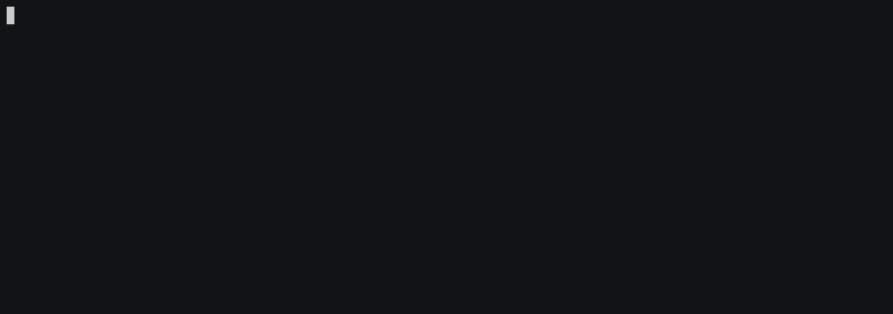

# Coin Exchange

An project made as an assignment for [JS com TDD na Prática](https://www.udemy.com/js-com-tdd-na-pratica/learn/v4/overview).

It uses Jest, Chalk, Inquirer, Webpack, Babel as main dependences.

Consumes two APIs: [Currency Stack](https://currencystack.io) and [Cryptonator](https://www.cryptonator.com/).

### Testing

Run the command: `npm run test`

### Building

Before build, you must create a `.env` file based on the `.env.example` file with your API key for [Currency Stack](https://currencystack.io).

Then run the command: `npm run build`. This will generate a `main.js` file on `/dist`;

### Using

Run the builded file: `node dist/main.js`

### Demo

